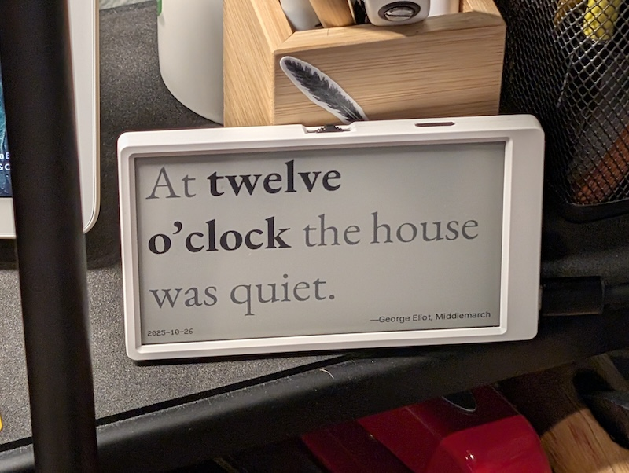

# M5Clock

A "literary clock" for M5Paper using M5Unified and M5GFX libraries.

Inspired by similar projects, such as [Literary Clock](https://www.literaryclock.com/) and the [Guardian](https://www.theguardian.com/books/booksblog/2014/jun/26/literary-clock-help-us-find-quotes-for-the-missing-minutes).

Because the M5Paper is an eink device and updates very slowly, this clock only changes once an hour, similar to a grandfather clock striking. You have other devices to tell you the precise time, this one lets your mind rest for a little while.



## Setup

1. **Configure WiFi credentials:**
   ```bash
   cp src/config.h.example src/config.h
   ```

2. **Edit `src/config.h` with your WiFi credentials:**
   ```cpp
   const char* WIFI_SSID = "YourWiFiNetworkName";
   const char* WIFI_PASS = "YourWiFiPassword";
   ```

3. **Prepare SD card with images:**
   - Insert an SD card into the M5Paper
   - Copy all PNG files from `img_gen/images/metadata/` to the SD card
   - Maintain the directory structure: `/images/metadata/quote_*.png`
   - Images should be named like `quote_HHMM_N_credits.png` where:
     - `HHMM` is 24-hour time format (e.g., "0508" for 5:08 AM)
     - `N` is zero-indexed option number (0, 1, 2, etc.)

4. **Build and upload:**
   ```bash
   pio run -t upload
   ```

## Features

- Displays full-screen PNG images based on current time
- Randomly selects from available images for each time period
- Falls back to nearest previous time if no images exist for current time
- Shows large time display when no images are available (white background)
- Shows date overlay in bottom-left corner
- Syncs time via HTTP from worldclockapi.com (on every boot, then once every 24 hours)
- Updates display every hour
- **Ultra-low power consumption**: Deep sleep between updates, wakes only for hourly changes
- **Smart time sync**: Only syncs time once per day to save battery and reduce WiFi usage
- **Simple time tracking**: Uses millis() for reliable 24-hour sync intervals after boot

## Copyright
All literary works quoted and the image generation code reused from an "Instructable" are copyright of their respective owners.

Everything else licensed under an [MIT license](./LICENSE).
